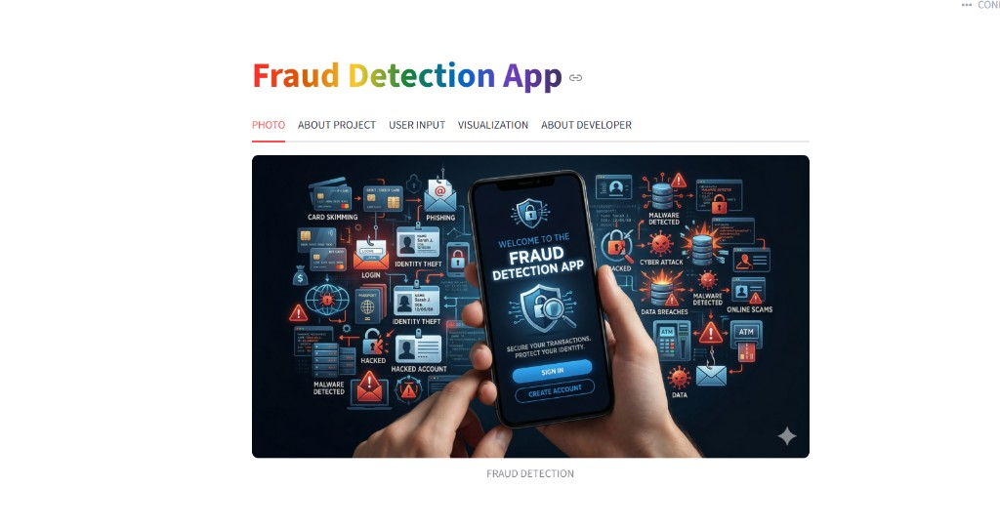
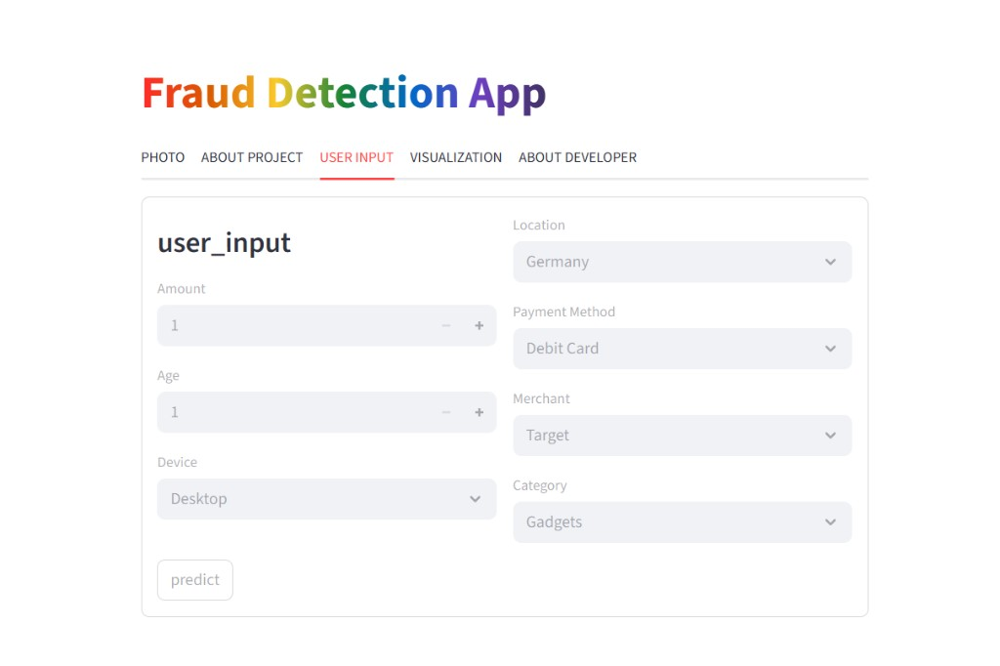
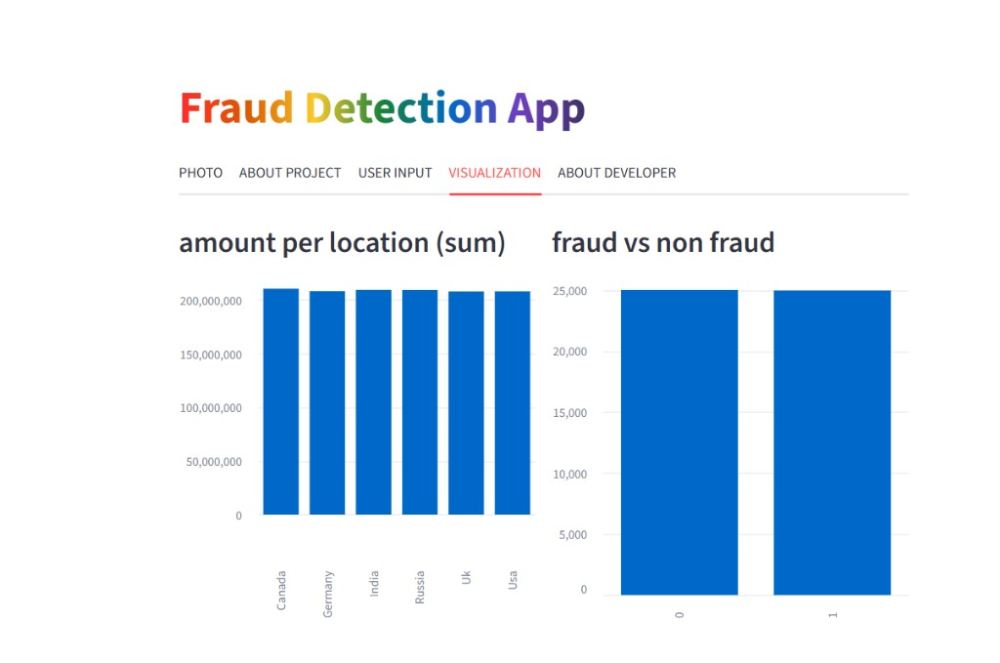

# Fraud Detection App

<p align="center">
  
</p>

End-to-end **fraud detection** for financial-style transactions: engineered features, **Random Forest** with **threshold tuning**, a **Streamlit** demo, and **Power BI** monitoring.

---

## Table of contents

- [Problem](#problem)
- [Solution](#solution)
- [Results](#results)
- [Business impact](#business-impact)
- [Demo](#demo)
- [Overview](#overview)
- [What this project does](#what-this-project-does)
- [Architecture (ML pipeline)](#architecture-ml-pipeline)
- [App walkthrough](#app-walkthrough)
- [Power BI dashboard](#power-bi-dashboard)
- [Tech stack](#tech-stack)
- [How to run](#how-to-run)
- [Project structure](#project-structure)
- [About the developer](#about-the-developer)

---

## Problem

**Fraud detection in financial transactions** — illegitimate charges and suspicious activity are costly for users and businesses. The goal is to flag high-risk transactions early using historical patterns (amount, location, device, merchant, payment method, and related signals) rather than relying on rules alone.

---

## Solution

- **ML pipeline** built with **Scikit-learn** (preprocessing + model in a single pipeline).
- **Random Forest** classifier with **threshold tuning** on predicted probabilities to balance precision and recall and better catch fraud under class imbalance.
- **Deployment**: trained artifact (`fraud_model.pkl`) consumed by a **Streamlit** app for interactive prediction; **Power BI** for KPIs and geographic/temporal views.

---

## Results

| Metric | Value |
|--------|-------|
| **ROC-AUC** | **0.84** |
| **Recall** | **0.81** |

*(Reported on the tuned evaluation setup; see `ML Code/` notebooks for full metrics and confusion matrix.)*

---

## Business impact

- **Identifies high-risk transactions** so analysts or automated rules can review or block before settlement.
- **Helps reduce fraud losses** by prioritizing recall on the positive (fraud) class while monitoring overall precision and ROC-AUC.
- Supports **operational dashboards** (Power BI) for fraud counts, rates, and location trends.

---

## Demo

Screenshots from the **Streamlit** app (**PHOTO**, **USER INPUT**, **VISUALIZATION**) and the **Power BI** report.

### Streamlit — PHOTO tab

Hero graphic: welcome screen with fraud / cybersecurity theme (**FRAUD DETECTION** caption).

<p align="center">
  
</p>

### Streamlit — USER INPUT tab

Transaction fields: **amount**, **age**, **device**, **location**, **payment method**, **merchant**, **category**, and **predict**.

<p align="center">
  
</p>

### Streamlit — VISUALIZATION tab

**Amount per location (sum)** and **fraud vs non-fraud** bar charts.

<p align="center">
  
</p>

### Power BI — fraud monitoring

KPIs, fraud rate, geography, trends, and transaction-level views.

<p align="center">
  
</p>

<p align="center">
  
</p>

<p align="center">
  
</p>

---

## Overview

This repository is an end-to-end **fraud detection** project: messy transaction data is cleaned and engineered, models are trained with **Scikit-learn** pipelines, and results are explored in **Power BI** and delivered through a **Streamlit** app where users enter transaction details and get a **live fraud probability** with clear approve / alert style feedback.

---

## What this project does

| Area | Description |
|------|-------------|
| **Data** | ETL, EDA, and feature engineering on transaction-style records (amount, location, device, merchant, etc.). |
| **ML** | **Logistic Regression**, **Random Forest**, and **Gradient Boosting** in pipelines; evaluation with accuracy, precision, recall, F1, ROC-AUC, and confusion matrices; **threshold tuning** for deployment. |
| **App** | **Streamlit** tabs: **PHOTO**, **ABOUT PROJECT**, **USER INPUT**, **VISUALIZATION**, **ABOUT DEVELOPER**. |
| **BI** | **Power BI** dashboards for KPIs, fraud rate, geography, and trends. |

---

## Architecture (ML pipeline)

1. **Ingest** — transaction streams, user behavior, and account context.  
2. **Feature engineering** — signals like transaction patterns, location consistency, and time-of-day behavior.  
3. **Train** — supervised learning on labeled **fraud vs legitimate** data; **Random Forest** with tuned decision threshold.  
4. **Deploy** — `fraud_model.pkl` serves **real-time inference** in Streamlit.  
5. **Decide** — fraud probability supports **approve**, **review**, or **block** workflows.

---

## App walkthrough

| Tab | Purpose |
|-----|---------|
| **PHOTO** | Branding / hero image (see [Demo](#demo)). |
| **ABOUT PROJECT** | ML approach, pipelines, metrics, and tools. |
| **USER INPUT** | Enter transaction details and run **predict** (see [Demo](#demo)). |
| **VISUALIZATION** | **Amount per location** and **fraud vs non-fraud** charts (see [Demo](#demo)). |
| **ABOUT DEVELOPER** | Bio, skills, GitHub / LinkedIn. |

After prediction: **probability**, progress bar, **Fraud Detected** vs **Safe Transaction**, with themed images for outcomes.

---

## Power BI dashboard

The report provides a **monitoring-style** view: total amounts, fraud counts, **fraud rate %**, fraud by location, trends over time, and transaction tables. **Screenshots** are in the [Demo](#demo) section above.

---

## Tech stack

- **Python** · **Pandas** · **NumPy**  
- **Scikit-learn** (pipelines, Random Forest, Logistic Regression, Gradient Boosting)  
- **Streamlit** · **Joblib**  
- **Matplotlib** · **Seaborn**  
- **MySQL** · **ETL** · **Power BI**

---

## How to run

1. Clone the repository and open the project folder.  
2. Install dependencies:

   ```bash
   pip install pandas scikit-learn streamlit joblib matplotlib seaborn
   ```

3. Place **`fraud_model.pkl`** at the project root (or update the path in `App/app.py`).  
4. Point **`feature_engineering.csv`** to your file for the **VISUALIZATION** tab (adjust paths in `App/app.py` if needed).  
5. Launch:

   ```bash
   streamlit run App/app.py
   ```

> **Note:** Some paths in `App/app.py` may be machine-specific; use paths **relative to the project folder** for portability (same as image paths in this README).

---

## Project structure

```
Fraud_Detection/
├── App/
│   └── app.py                          # Streamlit fraud detection app
├── data/
│   ├── raw_data/
│   │   └── ultra_messy_fraud_dataset_50000_rows.csv
│   └── clean_data/
│       └── fraud_cleaned_data_set.csv
├── EDA/
│   └── EDA.ipynb
├── ETL/
│   ├── Extract/
│   │   └── Extract.ipynb
│   ├── Transform/
│   │   └── transform.ipynb
│   └── Load/
│       └── Load.ipynb
├── Feature Engineering/
│   ├── Feature_engineering.py.ipynb
│   ├── feature_engineering.csv
│   └── feature_engineering.xlsx
├── ML Code/
│   └── ML.py.ipynb
├── power bi/                           # Power BI dashboard screenshots
├── screenshots/                        # Streamlit UI (PHOTO, USER INPUT, VISUALIZATION)
│   ├── streamlit_photo_tab.png
│   ├── streamlit_user_input.png
│   └── streamlit_visualization.png
├── SQL/
│   └── fraud_detection_sql_queries.sql
├── Gemini_Generated_Image_i45sm2i45sm2i45s.png
├── README.md
├── fraud_model.pkl                     # Deployed trained model (Streamlit)
├── fraud_models.pkl
├── Pipelines.pkl
├── OIP.jpg
└── OIP (1).jpg
```

---

## About the developer

**Induri Avinash Reddy** — B.Tech Computer Science student at **Chalapathi Institute of Engineering and Technology**, focused on **Data Science** and **Machine Learning**, with experience in Python, MySQL, Power BI, and end-to-end data projects.

- **GitHub:** [github.com/avinashreddy0](https://github.com/avinashreddy0)  
- **LinkedIn:** [Avinash Reddy Induri](https://www.linkedin.com/in/avinash-reddy-induri-4662b832a/)  

**Contact:** induriavinashreddy05@gmail.com · 9346739650  

---

<p align="center">
  <sub>Built for safer transactions and clearer data stories.</sub>
</p>
